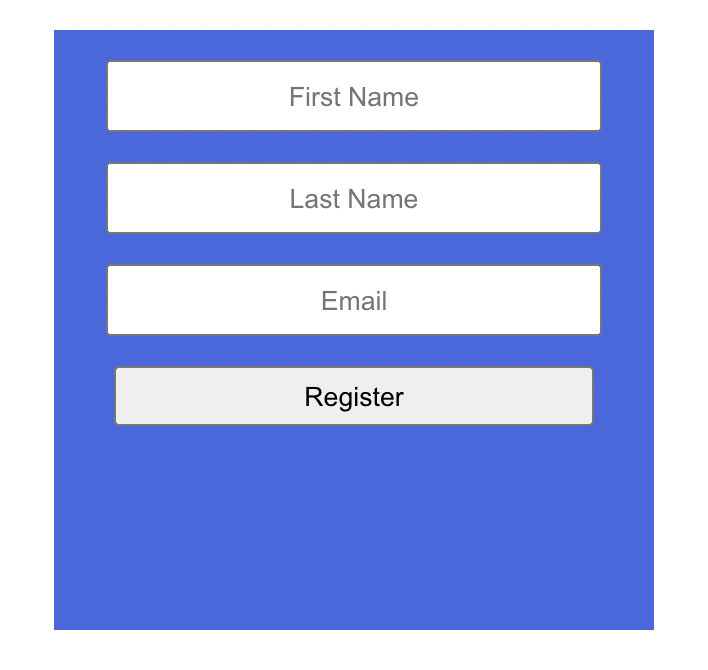
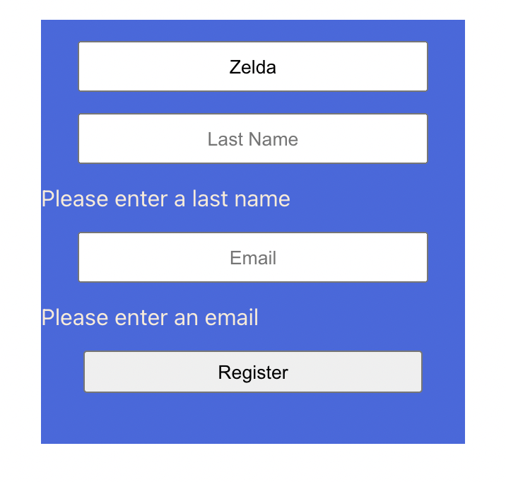
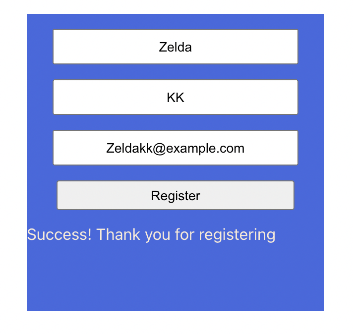

# About this project

This is a React starter's project about setting up a registration form. It will only allow users to register when they fill in all blanks in the form. Error messages and success message will be shown accordingly.

The default page is shown as below:

When users haven't filled all blanks, error messages will be shown:

When users enter all blanks and click on "Register" button, the success message will be shown as below:

